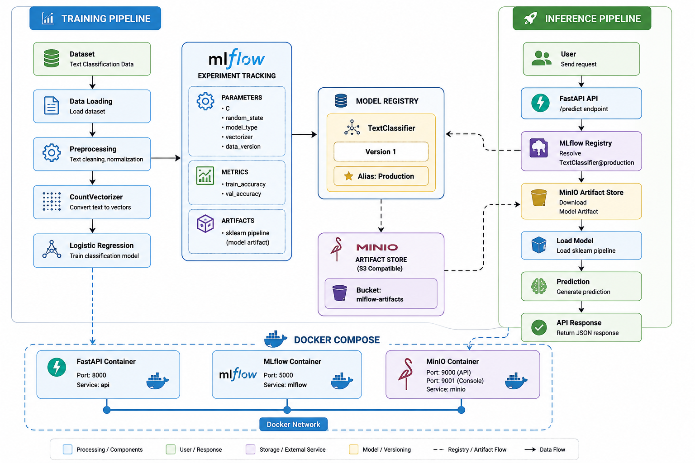

# 🚀 End-to-End MLOps Text Classification System

A production-grade MLOps pipeline for a text classification model featuring complete model lifecycle management using **MLflow Model Registry, Docker, FastAPI, and MinIO**.

This project demonstrates the transition from a simple `sklearn` model script to a robust, cloud-like architecture with experiment tracking, model versioning, artifact management, and containerized API serving.

---

## 🏗️ Architecture




### 1. Training Pipeline
- Loads dataset and splits data.
- Builds a `CountVectorizer` + `LogisticRegression` Pipeline.
- Logs parameters, metrics, and artifacts to **MLflow**.
- Automatically selects the best run based on validation accuracy and registers it in the MLflow Model Registry with the `production` alias.

### 2. Inference Pipeline
- A **FastAPI** application receives user requests.
- Queries the **MLflow Registry** for `TextClassifier@production`.
- Downloads the model artifact securely from **MinIO** (S3-compatible storage).
- Loads the model into memory, generates a prediction, and logs the result locally.

### 3. Deployment Stack (Docker Compose)
The entire infrastructure is fully containerized and orchestrated using Docker Compose:
- **FastAPI API**
- **MLflow Tracking Server**
- **MinIO Artifact Store**

---

## 🚀 Features

- **Experiment Tracking:** Logs hyperparameters (`C`, `random_state`, `vectorizer`) and metrics (`train_accuracy`, `val_accuracy`).
- **Model Registry & Promotion:** Automatically versions models and assigns the `production` alias to the best performing model.
- **S3 Artifact Management:** Uses MinIO to simulate an AWS S3 bucket (`s3://mlflow-artifacts`), eliminating local file path dependencies.
- **Containerized Serving:** Decoupled training and serving layers using Docker.
- **RESTful API:** FastAPI endpoints for health checks, model metadata, prediction, and analytics.

---

## 🛠️ Technologies Used

| Category | Tools |
|---|---|
| **Language** | Python 3.11 |
| **Machine Learning** | Scikit-Learn, Pandas, Numpy, Joblib |
| **MLOps & Tracking** | MLflow 3.14 |
| **Serving Framework** | FastAPI, Uvicorn |
| **Artifact Storage** | MinIO (S3 Compatible), Boto3 |
| **Infrastructure** | Docker, Docker Compose |

---

## 🚀 Getting Started (How to Reproduce)

### 1. Start the Infrastructure
Navigate to the deployment directory and start the Docker Compose stack (MinIO, MLflow Server, FastAPI):
```bash
cd deployment
docker compose up --build -d
```
*Wait for the containers to fully initialize before proceeding.*

### 2. Train and Register the Model
Run the training pipeline locally. It is configured to point to `http://localhost:5000` (your Dockerized MLflow) and will automatically upload artifacts to MinIO.
```bash
python -m src.train
```

### 3. Access the Services
Once the model is registered with the `production` alias, your API is fully operational!
- **FastAPI Swagger UI:** [http://localhost:8000/docs](http://localhost:8000/docs)
- **MLflow Dashboard:** [http://localhost:5000](http://localhost:5000)
- **MinIO Console:** [http://localhost:9001](http://localhost:9001) (Credentials: `admin` / `password`)

---

## 📡 API Endpoints

The FastAPI service exposes the following endpoints:

### `GET /`
**Response:**
```json
{ "message": "Welcome to MLOPs Training" }
```

### `GET /health`
**Response:**
```json
{ "status": "healthy" }
```

### `GET /model-info`
**Response:**
```json
{
  "model_name": "TextClassifier",
  "alias": "production"
}
```

### `POST /predict`
**Request:**
```json
{ "text": "zomato order" }
```
**Response:**
```json
{ "prediction": "food" }
```

### `GET /metrics`
**Response:**
```json
{
  "total_predictions": 3,
  "prediction_counts": {
    "food": 3
  }
}
```

---

## 🧠 Key MLOps Concepts Demonstrated

- **Experiment Tracking:** Reproducibility of model training configurations.
- **Model Registry & Versioning:** Safely iterating on models without losing history.
- **Model Aliases:** Using tags like `@production` to abstract version numbers from the serving layer.
- **Artifact Storage:** Separating code from model weights using cloud-native blob storage.
- **Containerization:** Eliminating "it works on my machine" issues.
- **Inference Serving:** Dynamic loading of production models via REST APIs.
- **Model Lifecycle Management:** End-to-end automation from training to deployment.

---

## 📊 Results

### Infrastructure Running in Docker
The entire system operates seamlessly in isolated containers via Docker Compose.


### FastAPI Swagger Interface
Comprehensive documentation and interactive testing for all API endpoints (`/predict`, `/health`, `/model-info`, `/metrics`).


### MinIO Remote Artifact Store
Model binaries and pipelines stored securely in an S3-compatible architecture, fully decoupled from local filesystems.


### MLflow Experiment Tracking & Registry
Tracking training runs and automatically registering the most accurate model under the `production` alias.


