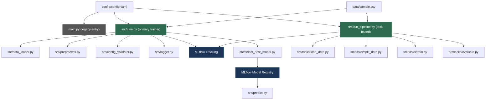
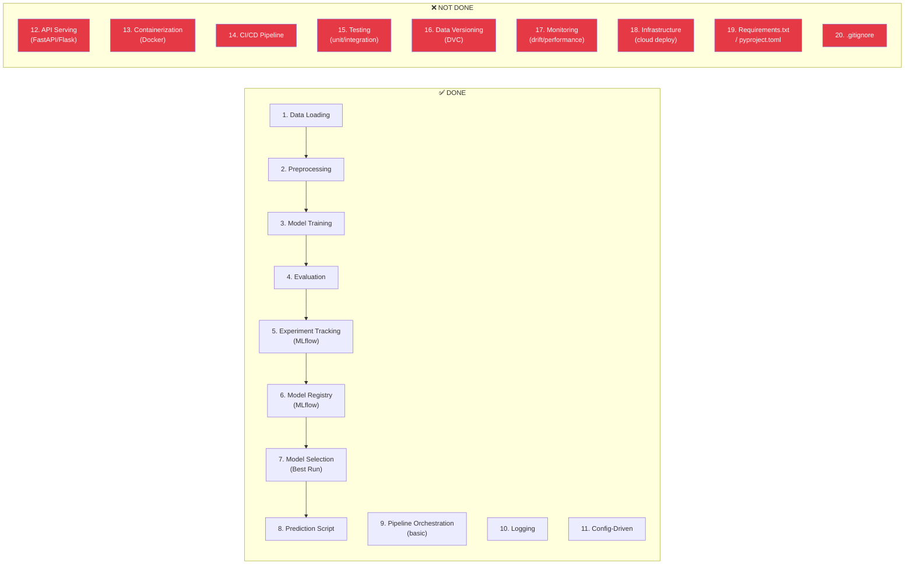

# 🔍 MLOps Training Codebase — Complete Analysis & Progress Report

---

## 1. Project Overview

**Problem:** Binary text classification (food vs travel) using Logistic Regression + CountVectorizer  
**Dataset:** ~32 samples in `sample.csv` (tiny, for learning purposes)  
**Current Accuracy:** **71.4%** (validation, 7 samples)  
**Tech Stack:** Python, scikit-learn, MLflow, YAML config, joblib/pickle  

---

## 2. Architecture Map



---

## 3. File-by-File Breakdown

### 📁 Entry Points (2 versions exist)

| File | Purpose | Status |
|------|---------|--------|
| [main.py](file:///d:/MLOps/mlops_training/main.py) | **Legacy** entry — monolithic script, no MLflow, no validation | ⚠️ Superseded |
| [src/train.py](file:///d:/MLOps/mlops_training/src/train.py) | **Primary** trainer — MLflow, pipeline, validation, auto-triggers model selection | ✅ Working |
| [src/run_pipeline.py](file:///d:/MLOps/mlops_training/src/run_pipeline.py) | **Task-based** pipeline — modular steps under `src/tasks/` with MLflow parent run | ✅ Working |

### 📁 Core Modules

| File | What it does | Notes |
|------|-------------|-------|
| [data_loader.py](file:///d:/MLOps/mlops_training/src/data_loader.py) | Loads CSV with error handling + logging | ✅ Clean |
| [preprocess.py](file:///d:/MLOps/mlops_training/src/preprocess.py) | Train/val split (80/20, stratified) | ✅ Clean |
| [config_validator.py](file:///d:/MLOps/mlops_training/src/config_validator.py) | Validates data_path exists, creates model dir | ✅ Minimal |
| [logger.py](file:///d:/MLOps/mlops_training/src/logger.py) | File-based logging to `logs/app.log` | ⚠️ Returns module, not a named logger |
| [predict.py](file:///d:/MLOps/mlops_training/src/predict.py) | Loads model from MLflow Model Registry by alias `@production` | ✅ Working |
| [select_best_model.py](file:///d:/MLOps/mlops_training/src/select_best_model.py) | Queries MLflow for best run, registers model, sets `production` alias | ✅ Working |
| [register_model.py](file:///d:/MLOps/mlops_training/src/register_model.py) | Manual model registration by run_id (utility) | ✅ Utility |

### 📁 Task Modules (`src/tasks/`)

| File | Status |
|------|--------|
| [load_data.py](file:///d:/MLOps/mlops_training/src/tasks/load_data.py) | ✅ Reads CSV, saves as artifact |
| [split_data.py](file:///d:/MLOps/mlops_training/src/tasks/split_data.py) | ✅ Train/val split, saves to CSVs |
| [train.py](file:///d:/MLOps/mlops_training/src/tasks/train.py) | ✅ Pipeline-based training with MLflow logging |
| [evaluate.py](file:///d:/MLOps/mlops_training/src/tasks/evaluate.py) | ✅ Evaluation with metrics JSON output |
| [register.py](file:///d:/MLOps/mlops_training/src/tasks/register.py) | ❌ **Empty** |
| [select_best.py](file:///d:/MLOps/mlops_training/src/tasks/select_best.py) | ❌ **Empty** |

### 📁 Data & Artifacts

| Path | Description |
|------|-------------|
| `data/sample.csv` | 32 labeled samples (food/travel) |
| `data/raw.csv`, `train.csv`, `val.csv` | Pipeline-generated splits |
| `models/model.pkl` | Serialized sklearn Pipeline |
| `metrics/metrics.json` | `{"accuracy": 0.714}` |
| `mlflow.db` | SQLite backend (~1.2MB) for MLflow |
| `mlruns/` | 4 experiments (IDs: 0, 2, 3, 5), 20+ runs |
| `vectorizer.pkl` | Legacy artifact (from old approach) |

---

## 4. MLOps Lifecycle Progress

### What you've covered — mapped to the standard MLOps lifecycle:



### Detailed Progress Breakdown:

| MLOps Phase | Status | Details |
|---|---|---|
| **Data Ingestion** | ✅ Done | CSV loading with error handling |
| **Preprocessing** | ✅ Done | Train/val split, stratified, reproducible (`random_state=42`) |
| **Feature Engineering** | ✅ Basic | CountVectorizer in sklearn Pipeline |
| **Model Training** | ✅ Done | LogisticRegression, configurable hyperparameters (`C`, `random_state`) |
| **Evaluation** | ✅ Done | Accuracy metric on validation set |
| **Experiment Tracking** | ✅ Done | MLflow with params, metrics, and model artifacts logged |
| **Model Registry** | ✅ Done | MLflow Model Registry with `TextClassifier` model + `production` alias |
| **Model Selection** | ✅ Done | Automated best-run selection by `val_accuracy` |
| **Prediction/Inference** | ✅ Partial | Script exists, loads from registry — but **no API endpoint** |
| **Pipeline Orchestration** | ✅ Basic | Two approaches exist (monolithic `train.py` + task-based `run_pipeline.py`) |
| **Logging** | ✅ Done | File-based logging throughout |
| **Config Management** | ✅ Done | YAML-driven configuration |
| **API Serving** | ❌ Missing | No FastAPI/Flask/BentoML endpoint |
| **Containerization** | ❌ Missing | No Dockerfile |
| **CI/CD** | ❌ Missing | No GitHub Actions/Jenkins pipeline |
| **Testing** | ❌ Missing | Zero tests (unit, integration, or data validation) |
| **Data Versioning** | ❌ Missing | No DVC, no data pipeline tracking |
| **Model Monitoring** | ❌ Missing | No drift detection, no performance monitoring |
| **Dependency Management** | ❌ Missing | No `requirements.txt` or `pyproject.toml` |
| **Repository Hygiene** | ❌ Missing | No `.gitignore` — `.pyc`, `mlruns/`, `mlflow.db` are all committed |

---

## 5. Learning Timeline (Reconstructed from Logs)

| Date | What you did | Key Learning |
|------|-------------|-------------|
| **Mar 23** | Basic training script, tested error handling with wrong paths, added config validation | Config-driven ML, error handling |
| **Mar 23** | Integrated MLflow tracking for the first time | Experiment tracking basics |
| **Mar 24** | Added train/val split, experimented with vectorizer, hit `X_vec` bugs, fixed them | Proper train/val methodology |
| **Mar 24** | Multiple runs with MLflow, iterated on hyperparams (`C=10`) | Hyperparameter experimentation |
| **Mar 28** | Added data distribution logging, expanded dataset (20→32 samples), added `C` param | Data analysis, feature engineering |
| **Mar 28** | Built automated model selection + registry pipeline | Model lifecycle management |
| **Mar 30** | First git commit | Version control |
| **Apr 3** | Built task-based pipeline (`src/tasks/`), hit multiple bugs (typos, path issues, joblib) | Pipeline thinking, debugging |
| **Apr 8** | Second commit — pipeline fixes | Iterative development |
| **Apr 12** | Pipeline working end-to-end with MLflow integration, evaluation saving metrics | Full pipeline execution |
| **Apr 13** | Latest commit — pipeline with MLflow parent run | Advanced MLflow usage |

> You've been learning for approximately **3 weeks** (Mar 23 → Apr 13), with activity slowing after April 13.

---

## 6. Code Quality Observations

### 👍 Good Practices
- Consistent error handling with try/except throughout
- Logging at every pipeline step
- Config-driven approach (no hardcoded hyperparams)
- Using sklearn `Pipeline` (vectorizer + model together) — prevents data leakage
- Stratified train/val split for balanced evaluation
- MLflow experiment tracking with meaningful param logging
- Model Registry with production alias — proper model lifecycle

### ⚠️ Areas for Improvement

| Issue | Where | Impact |
|------|-------|--------|
| **Logger returns module, not named logger** | [logger.py](file:///d:/MLOps/mlops_training/src/logger.py) — `return logging` instead of `return logging.getLogger(__name__)` | All log entries share same unnamed logger |
| **Hardcoded absolute paths in config** | [config.yaml](file:///d:/MLOps/mlops_training/config/config.yaml) — `D:/MLOps/mlops_training/...` | Won't work on other machines |
| **Duplicate logic** | `main.py` vs `src/train.py` vs `src/run_pipeline.py` — 3 ways to train | Confusion about which is canonical |
| **Empty task files** | `src/tasks/register.py` and `src/tasks/select_best.py` are empty | Incomplete pipeline |
| **Module-level code** | [split_data.py](file:///d:/MLOps/mlops_training/src/tasks/split_data.py#L7-L8) loads config at import time | Side effects on import |
| **subprocess coupling** | [src/train.py:97-103](file:///d:/MLOps/mlops_training/src/train.py#L97-L103) — calls model selection via `subprocess.run` | Fragile, should be a function call |
| **No `.gitignore`** | `.pyc`, `mlruns/`, `mlflow.db`, model artifacts all committed | Bloated repo, leaks artifacts |
| **No dependency file** | No `requirements.txt` | Not reproducible on other machines |

---

## 7. What's Missing for Productionization

Here's a prioritized roadmap of **exactly** what you need to build next, in order:

### 🏗️ Phase 1: Foundation Fixes (Do These First)

```
Priority: CRITICAL — Without these, nothing else works properly
```

| # | Task | Why |
|---|------|-----|
| 1 | Create `requirements.txt` | Anyone (or Docker) can `pip install` and run your code |
| 2 | Create `.gitignore` | Stop committing `__pycache__/`, `mlruns/`, `*.pkl`, `mlflow.db`, `logs/` |
| 3 | Fix `config.yaml` to use relative paths | Portability across machines |
| 4 | Fix `logger.py` to return a proper named logger | Cleaner, filterable logs |
| 5 | Remove `main.py` (legacy) & pick ONE pipeline approach | Clarity of architecture |
| 6 | Complete empty task files (`register.py`, `select_best.py`) | Full pipeline |

### 🚀 Phase 2: API Serving

```
Priority: HIGH — This is the "productionizing" step
```

| # | Task | Tech |
|---|------|------|
| 7 | Build a FastAPI prediction endpoint | `POST /predict` → accepts text → returns label |
| 8 | Load model from MLflow registry at startup | `mlflow.sklearn.load_model("models:/TextClassifier@production")` |
| 9 | Add request/response schemas (Pydantic) | Input validation, documentation |
| 10 | Add health check endpoint | `GET /health` for monitoring |

### 🐳 Phase 3: Containerization

```
Priority: HIGH — Makes deployment reproducible
```

| # | Task | Tech |
|---|------|------|
| 11 | Write a `Dockerfile` | Python base image, install deps, copy code, run API |
| 12 | Write `docker-compose.yml` | App + MLflow server (optional) |
| 13 | Test locally with Docker | Verify everything works in isolation |

### 🧪 Phase 4: Testing

```
Priority: MEDIUM — Proves your code is reliable
```

| # | Task | Tech |
|---|------|------|
| 14 | Unit tests for `data_loader`, `preprocess`, `config_validator` | pytest |
| 15 | Integration test for full pipeline | pytest + fixtures |
| 16 | Data validation tests (schema, nulls, label distribution) | Great Expectations or custom |
| 17 | Model validation tests (min accuracy threshold) | pytest |

### 🔄 Phase 5: CI/CD Pipeline

```
Priority: MEDIUM — Automates everything
```

| # | Task | Tech |
|---|------|------|
| 18 | GitHub Actions workflow: lint + test on PR | `.github/workflows/ci.yml` |
| 19 | Auto-train on data change | Trigger pipeline on push to `data/` |
| 20 | Auto-deploy on model registry update | CD pipeline to rebuild & deploy container |

### 📊 Phase 6: Advanced MLOps

```
Priority: LOWER (for now) — Polish and scale
```

| # | Task | Tech |
|---|------|------|
| 21 | Data versioning with DVC | Track `data/sample.csv` versions |
| 22 | Model monitoring (accuracy drift) | Evidently AI or custom |
| 23 | A/B testing infrastructure | Serve multiple model versions |
| 24 | Cloud deployment (AWS/GCP/Azure) | ECS, Cloud Run, or AKS |
| 25 | Feature store | For complex feature pipelines |

---

## 8. Summary Scorecard

| Dimension | Score | Comment |
|-----------|-------|---------|
| **Data Pipeline** | 7/10 | Working, but no versioning |
| **Model Training** | 8/10 | Config-driven, pipeline-based, reproducible |
| **Experiment Tracking** | 9/10 | MLflow well-integrated with params, metrics, artifacts |
| **Model Registry** | 8/10 | Working with aliases, automated best-model selection |
| **API Serving** | 1/10 | Only a script, no HTTP endpoint |
| **Testing** | 0/10 | No tests at all |
| **CI/CD** | 0/10 | No automation |
| **Containerization** | 0/10 | No Docker |
| **Monitoring** | 0/10 | Nothing |
| **Repo Quality** | 3/10 | No `.gitignore`, no `requirements.txt`, committed artifacts |

### **Overall Progress: ~45% of a production MLOps lifecycle**

> [!IMPORTANT]
> You've built a **solid training & experiment tracking foundation**. The core ML pipeline (data → train → evaluate → register → predict) works end-to-end. The biggest gap is everything **after** the model is trained: serving, containerization, testing, CI/CD, and monitoring. That's where productionization lives.

---

## 9. Recommended Immediate Next Step

Start with **Phase 1** (foundation fixes) — it takes ~30 minutes and makes everything else cleaner. Then jump straight to **Phase 2** (FastAPI endpoint) — that's the single most impactful step toward "productionizing" your ML model.

Would you like me to start implementing any of these phases?
