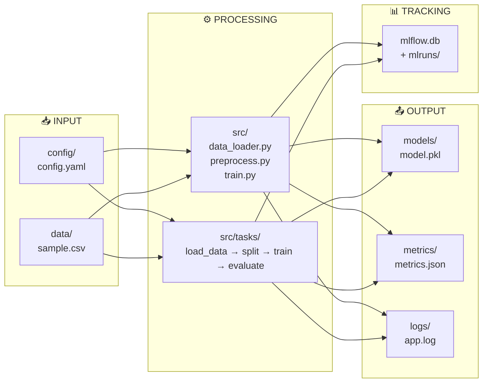
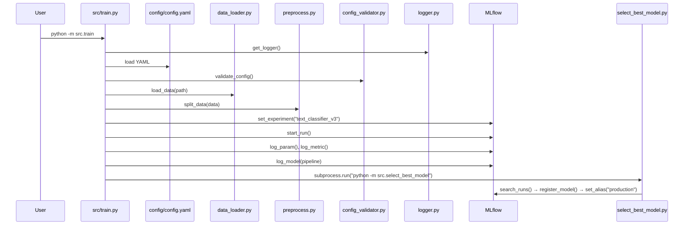
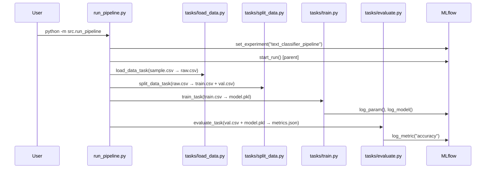

# 📁 MLOps Training — Complete Folder Structure

---

## Full Directory Tree

```
mlops_training/
│
├── 📄 main.py                          # Legacy entry point (superseded by src/train.py)
├── 📄 vectorizer.pkl                   # Legacy artifact from old approach
├── 🗄️ mlflow.db                        # MLflow SQLite backend (1.2 MB)
│
├── ⚙️ config/
│   └── config.yaml                     # Hyperparams + paths (YAML-driven config)
│
├── 📊 data/
│   ├── sample.csv                      # Original dataset (32 samples, food/travel)
│   ├── raw.csv                         # Pipeline-generated copy of sample.csv
│   ├── train.csv                       # Training split (25 samples)
│   └── val.csv                         # Validation split (7 samples)
│
├── 📝 logs/
│   └── app.log                         # Application logs (24 KB, 363 lines of history)
│
├── 📈 metrics/
│   └── metrics.json                    # Evaluation output {"accuracy": 0.714}
│
├── 🤖 models/
│   └── model.pkl                       # Serialized sklearn Pipeline (2.3 KB)
│
├── 🧪 mlruns/                          # MLflow experiment tracking store
│   ├── 0/                              # Experiment: "Default" (early runs)
│   │   ├── 304d53da.../                # 1 run
│   │   │   └── artifacts/              # Logged model artifacts
│   │   └── models/                     # 8 registered model versions
│   │       ├── m-45aa9393.../
│   │       ├── m-4f46ff76.../
│   │       ├── m-568bd47d.../
│   │       ├── m-5ab54067.../
│   │       ├── m-c1d1ecb7.../
│   │       ├── m-e224c12c.../
│   │       ├── m-e484b271.../
│   │       └── m-fa3bcc60.../
│   │
│   ├── 2/                              # Experiment: "text_classifier_v2"
│   │   └── models/                     # 4 registered model versions
│   │       ├── m-07b07437.../
│   │       ├── m-59505277.../
│   │       ├── m-b892f9fb.../
│   │       └── m-f7db8053.../
│   │
│   ├── 3/                              # Experiment: "text_classifier_v3"
│   │   └── models/                     # 6 registered model versions
│   │       ├── m-2397faa0.../
│   │       ├── m-3a02fb16.../
│   │       ├── m-7b3276d1.../
│   │       ├── m-7bc3c2c3.../
│   │       ├── m-e22dc891.../
│   │       └── m-f2b8d8bd.../
│   │
│   └── 5/                              # Experiment: "text_classifier_pipeline"
│       └── models/                     # 1 registered model version
│           └── m-8f4137a2.../
│
├── 🐍 src/                             # Main source package
│   ├── __init__.py                     # Package marker (empty)
│   ├── train.py                        # ⭐ Primary trainer (MLflow + Pipeline + auto model selection)
│   ├── data_loader.py                  # CSV loader with error handling
│   ├── preprocess.py                   # Train/val splitter (stratified, 80/20)
│   ├── config_validator.py             # Validates paths from config.yaml
│   ├── logger.py                       # File-based logging setup
│   ├── predict.py                      # Inference from MLflow Model Registry
│   ├── select_best_model.py            # Finds best run → registers → sets production alias
│   ├── register_model.py               # Manual model registration utility
│   ├── run_pipeline.py                 # ⭐ Task-based pipeline orchestrator
│   │
│   └── 📦 tasks/                       # Modular pipeline steps
│       ├── load_data.py                # Step 1: Load & save raw data
│       ├── split_data.py               # Step 2: Train/val split → CSV files
│       ├── train.py                    # Step 3: Train model + log to MLflow
│       ├── evaluate.py                 # Step 4: Evaluate + save metrics
│       ├── register.py                 # Step 5: (EMPTY — not implemented)
│       └── select_best.py              # Step 6: (EMPTY — not implemented)
│
└── 📁 .git/                            # Git repository
```

---

## File Size Summary

| Category | Files | Total Size | Notes |
|----------|-------|-----------|-------|
| **Source Code** (`src/`) | 11 files | ~11 KB | Core Python modules |
| **Task Modules** (`src/tasks/`) | 6 files | ~4.3 KB | 2 are empty |
| **Data** (`data/`) | 4 files | ~2.2 KB | Tiny dataset (32 samples) |
| **Config** (`config/`) | 1 file | 190 B | Single YAML file |
| **Model Artifacts** (`models/`) | 1 file | 2.3 KB | Serialized sklearn Pipeline |
| **Metrics** (`metrics/`) | 1 file | 32 B | JSON with accuracy |
| **Logs** (`logs/`) | 1 file | 24 KB | 363 lines of run history |
| **MLflow DB** | 1 file | 1.2 MB | SQLite tracking store |
| **MLflow Runs** (`mlruns/`) | 98 files | ~50 KB | 4 experiments, 19+ model versions |
| **Legacy** | 2 files | ~1.4 KB | `main.py` + `vectorizer.pkl` |

---

## How Each Directory Fits in the MLOps Pipeline



---

## Execution Flow — Which Files Call Which

### Path A: Direct Training (`python -m src.train`)



### Path B: Task Pipeline (`python -m src.run_pipeline`)



---

## MLflow Experiments Breakdown

| Experiment ID | Name | Registered Models | Description |
|---|---|---|---|
| `0` | Default | 8 versions | Early experimentation (Mar 23–24) |
| `2` | text_classifier_v2 | 4 versions | Added train/val split, vectorizer |
| `3` | text_classifier_v3 | 6 versions | Added `C` param, expanded dataset, auto selection |
| `5` | text_classifier_pipeline | 1 version | Task-based pipeline approach (Apr 12–13) |
| **Total** | — | **19 model versions** | Registered under name `TextClassifier` |

---

## Files That Should NOT Be in Git

> [!WARNING]
> These files/folders are currently **committed to git** but should be in `.gitignore`:

```
# Should be gitignored
__pycache__/              # Python bytecode cache
mlruns/                   # MLflow run artifacts (98 files)
mlflow.db                 # MLflow SQLite database (1.2 MB)
*.pkl                     # Serialized model files
logs/app.log              # Runtime logs
data/raw.csv              # Generated artifacts
data/train.csv            # Generated artifacts
data/val.csv              # Generated artifacts
metrics/metrics.json      # Generated artifacts
```

---

## Files That Are MISSING

> [!IMPORTANT]
> These standard MLOps project files don't exist yet:

```
# Missing — should be created
├── .gitignore              # Repository hygiene
├── requirements.txt        # Python dependencies
├── Dockerfile              # Containerization
├── docker-compose.yml      # Multi-service orchestration
├── README.md               # Project documentation
├── tests/                  # Test suite
│   ├── test_data_loader.py
│   ├── test_preprocess.py
│   ├── test_train.py
│   └── test_pipeline.py
├── app.py                  # FastAPI/Flask serving endpoint
├── dvc.yaml                # Data versioning pipeline
├── .github/
│   └── workflows/
│       └── ci.yml          # CI/CD pipeline
└── src/tasks/
    ├── register.py         # ← Exists but EMPTY
    └── select_best.py      # ← Exists but EMPTY
```
